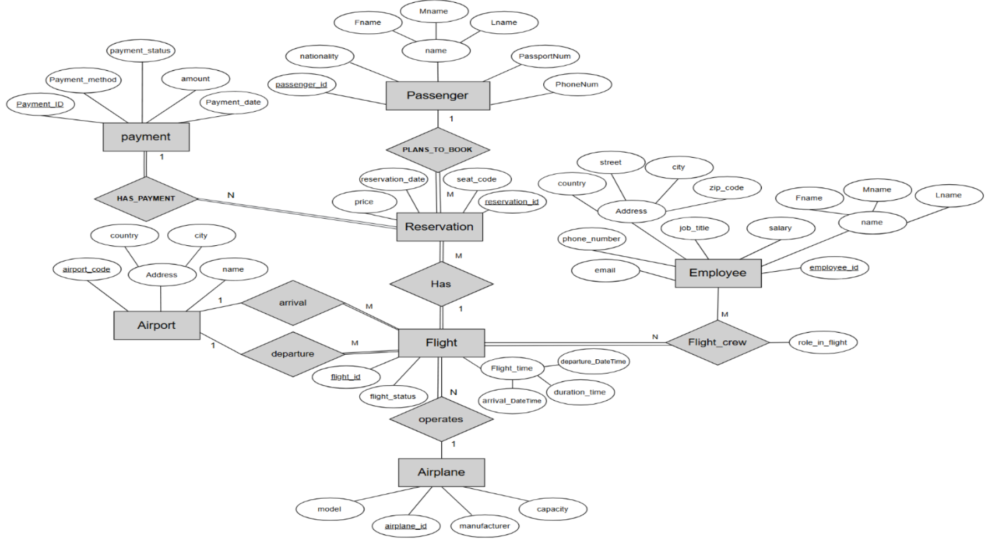
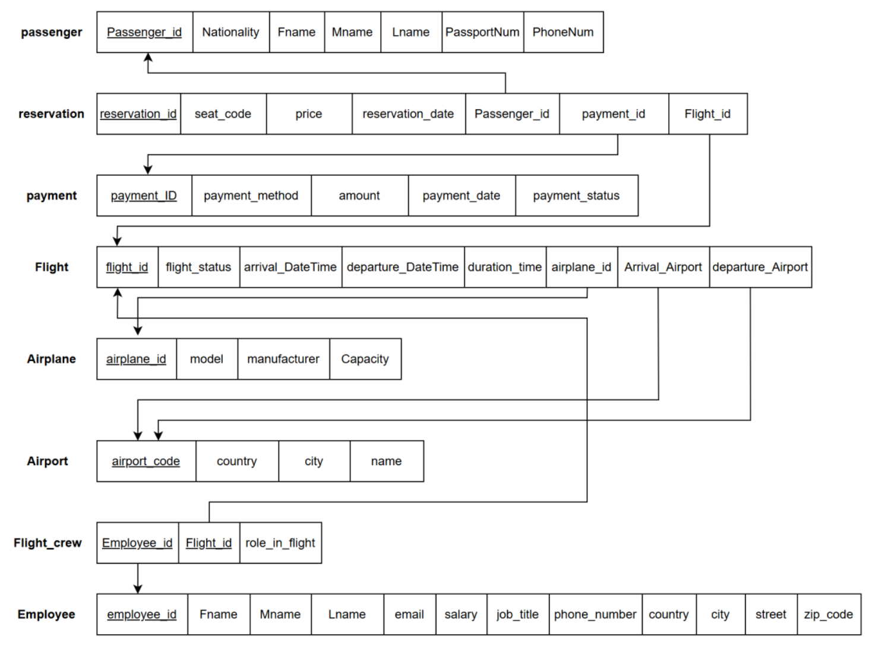
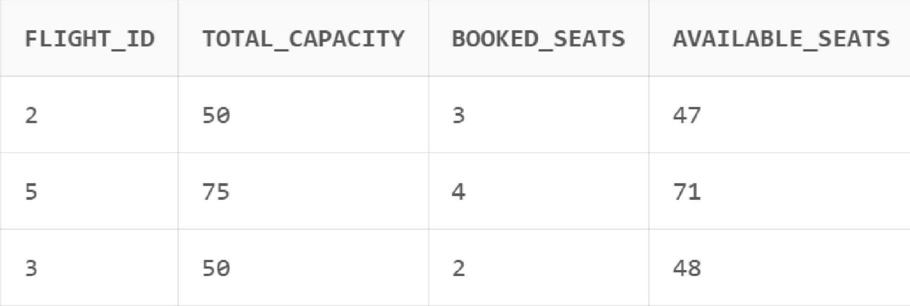
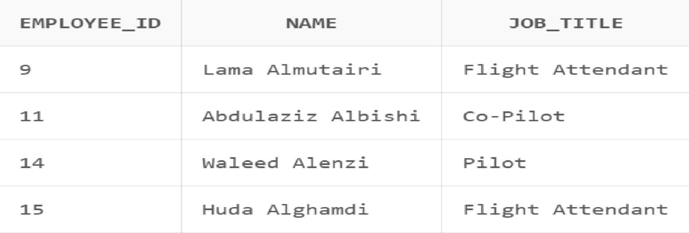
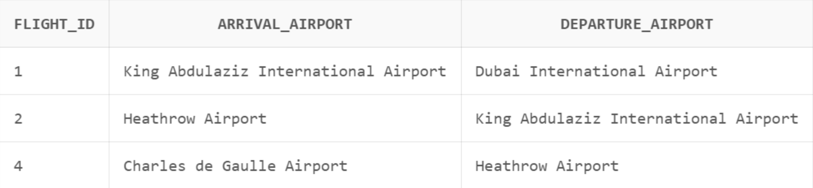
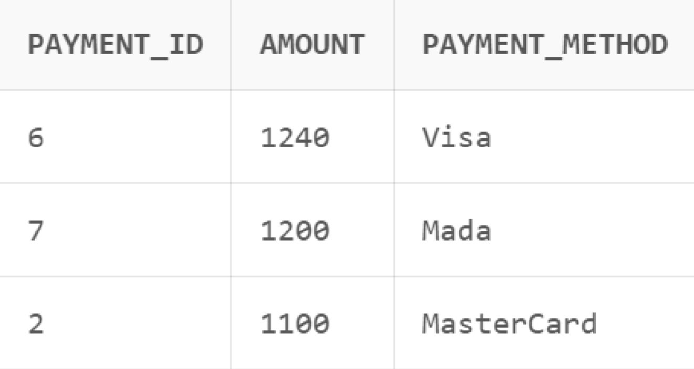
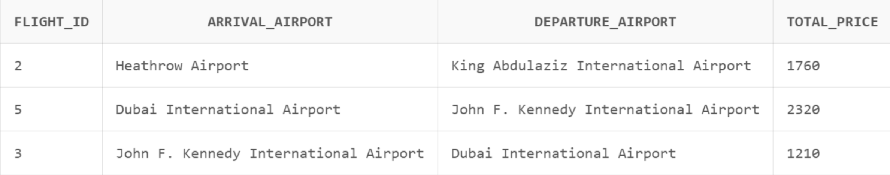
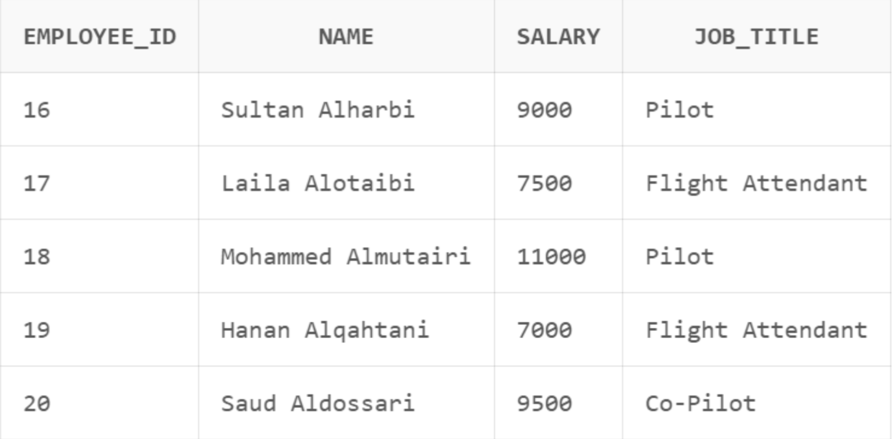

# Flight Reservation and Management System

A SQL database project for designing and implementing a Flight Reservation and Management System.

## Overview
This project models an airline reservation system that manages passengers, reservations, payments, flights, airports, airplanes, and employee crew assignments.

The system was designed to support airline operations by organizing booking records, tracking payment information, assigning airplanes to flights, linking airports to routes, and connecting employees to flight-specific roles.

## Main Entities
- Passenger
- Payment
- Reservation
- Flight
- Employee
- Airport
- Airplane
- Flight_Crew

## Business Rules
- A reservation cannot be confirmed unless a successful payment has been made.
- A payment may include more than one reservation.
- A reservation cannot be split into more than one payment.
- A flight must have both a departure airport and an arrival airport.
- A flight is managed by exactly one airplane.
- An employee can work on multiple flights, and each flight can include multiple employees.
- An employee’s assigned role in a specific flight may differ from their general job title.

## Development Process
This project was completed through multiple database design and implementation stages:

1. **System Analysis**
   - Defined the scope of the flight reservation system
   - Identified required entities, attributes, and business rules

2. **Database Design**
   - Designed the ER diagram
   - Mapped the ER model into a relational schema
   - Applied normalization principles up to Third Normal Form (3NF)

3. **Implementation**
   - Created database tables using SQL
   - Added primary keys and foreign key relationships
   - Wrote SQL queries to retrieve useful operational and reporting data

## Design Notes
The schema follows core normalization principles:
- **1NF** by storing atomic values
- **2NF** in the `Flight_Crew` table through its composite key
- **3NF** by separating airport location details into the `Airport` table instead of storing them in `Flight`

## Repository Structure
- `diagrams/erd.png` → ER diagram
- `diagrams/schema-diagram.png` → final relational schema diagram
- `sql/schema.sql` → table creation statements
- `sql/relationships.sql` → foreign key relationships
- `sql/queries.sql` → analytical SQL queries
- `screenshots/` → query output screenshots

## Diagrams

### ER Diagram
The ER diagram represents the conceptual design of the system. It shows the main entities, their attributes, and the relationships between them.



### Schema Diagram
The schema diagram represents the final relational database structure after converting the conceptual design into implementation-ready tables.



## How to Run
1. Run `sql/schema.sql`
2. Run `sql/relationships.sql`
3. Run `sql/queries.sql`

## Sample Queries and Results

### 1. Booked and Available Seats per Flight
This query shows the number of booked seats and available seats for each flight.

```sql
SELECT 
    f.flight_id,
    a.capacity AS total_capacity,
    COUNT(r.reservation_id) AS booked_seats,
    (a.capacity - COUNT(r.reservation_id)) AS available_seats
FROM Flight f
JOIN Airplane a ON f.airplane_id = a.airplane_id
LEFT JOIN Reservation r ON f.flight_id = r.flight_id
LEFT JOIN Payment p ON r.payment_id = p.payment_id
WHERE p.payment_status = 1
GROUP BY f.flight_id, a.capacity;
```



### 2. Employees Assigned to the Highest Number of Flights
This query retrieves the employee or employees assigned to the highest number of flights.

```sql
SELECT employee_id, name, job_title, flight_count
FROM (
    SELECT 
        e.employee_id,
        e.fname || ' ' || e.lname AS name,
        e.job_title,
        COUNT(fc.flight_id) AS flight_count
    FROM Employee e
    JOIN Flight_Crew fc ON e.employee_id = fc.employee_id
    GROUP BY e.employee_id, e.fname, e.lname, e.job_title
    HAVING COUNT(fc.flight_id) = (
        SELECT MAX(emp_count)
        FROM (
            SELECT COUNT(*) AS emp_count
            FROM Flight_Crew
            GROUP BY employee_id
        )
    )
);
```



### 3. Flights with at Least One Cancelled Reservation
This query retrieves flights that have at least one reservation linked to an unsuccessful payment.

```sql
SELECT 
    f.flight_id,
    arr.name AS arrival_airport,
    dep.name AS departure_airport
FROM Flight f
JOIN Airport arr ON f.arrival_airport = arr.airport_code
JOIN Airport dep ON f.departure_airport = dep.airport_code
WHERE EXISTS (
    SELECT 1
    FROM Reservation r
    JOIN Payment p ON r.payment_id = p.payment_id
    WHERE r.flight_id = f.flight_id
      AND p.payment_status = 0
);
```



### 4. Payments Greater Than the Average Successful Payment
This query retrieves successful payments with amounts greater than the average successful payment amount.

```sql
SELECT payment_id, amount, payment_method
FROM Payment
WHERE payment_status = 1
  AND amount > (
      SELECT AVG(amount)
      FROM Payment
      WHERE payment_status = 1
  )
ORDER BY amount DESC;
```



### 5. Total Price for Each Flight
This query calculates the total successful payment amount for each flight.

```sql
SELECT 
    f.flight_id,
    arr.name AS arrival_airport,
    dep.name AS departure_airport,
    SUM(p.amount) AS total_price
FROM Flight f
JOIN Airport arr ON f.arrival_airport = arr.airport_code
JOIN Airport dep ON f.departure_airport = dep.airport_code
JOIN Reservation r ON f.flight_id = r.flight_id
JOIN Payment p ON r.payment_id = p.payment_id
WHERE p.payment_status = 1
GROUP BY f.flight_id, arr.name, dep.name
ORDER BY f.flight_id;
```



### 6. Employees Not Assigned to Any Flight
This query retrieves employees who do not appear in the `Flight_Crew` table.

```sql
SELECT 
    employee_id,
    fname || ' ' || lname AS name,
    salary,
    job_title
FROM Employee
WHERE employee_id NOT IN (
    SELECT employee_id
    FROM Flight_Crew
)
ORDER BY employee_id;
```



